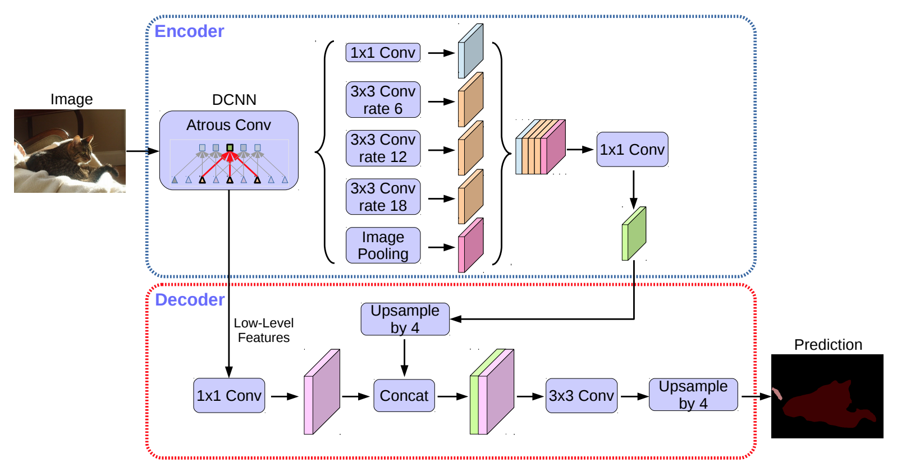

# DeepLab Training Pipeline

This repo is based on the Keras code available in here - https://keras.io/examples/vision/deeplabv3_plus/

## Building the DeepLabV3+ model

DeepLabv3+ extends DeepLabv3 by adding an encoder-decoder structure. The encoder module processes multiscale contextual
information by applying dilated convolution at multiple scales, while the decoder module refines the segmentation
results along object boundaries.



## Installation

### Install docker

Find the installation files under scripts directory

```bash
bash install_docker_ce.sh
```

### Install nvidia-docker runtime

```bash
bash install_nvidia-runtime.sh
```

### Download the dataset

[comment]: <> (This is trained using Crowd Instance-level Human Parsing Dataset)

[comment]: <> (Link - https://drive.google.com/uc?id=1B9A9UCJYMwTL4oBEo4RZfbMZMaZhKJaz)

Pascal VOC download link

http://host.robots.ox.ac.uk/pascal/VOC/voc2012/VOCtrainval_11-May-2012.tar

### Extract the dataset and keepunder dataset-dir

[comment]: <> (unzip instance-level-human-parsing.zip)

[comment]: <> (mv instance-level_human_parsing <dataset-dir>)

```bash
tar -xcf VOCtrainval_11-May-2012.tar
mv VOCtrainval_11-May-2012 <dataset-dir>
```

### Build the docker

```bash
bash build.sh
```

### Set the path to the dataset location in docker_run.sh script

[comment]: <> (DATASET_LOC=<dataset-dir>/instance-level_human_parsing/instance-level_human_parsing)
```bash
DATASET_LOC=<dataset-dir>/VOCtrainval_11-May-2012/VOCdevkit/VOC2012
```

### Create container with the shared dataset

```bash
bash docker_run.sh
```

### Run the training

```bash
bash train.sh
```
